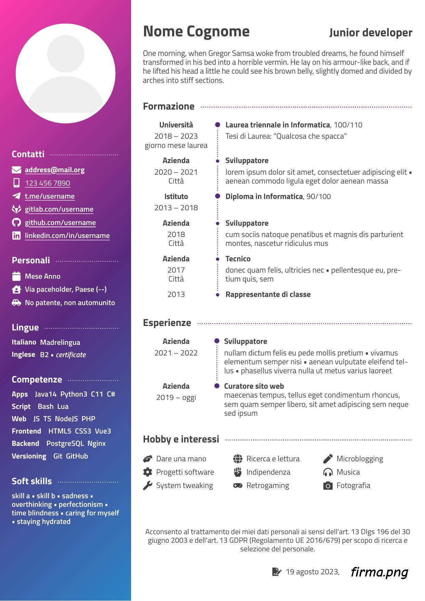

<div align="center">
<h2>CV template</h2>

Pure HTML+CSS+JS curriculum vitæ template, to be printed to PDF from browsers.



</div>

---

<br>

[toc]

<br>


## Motivation

- needed a new _and cool_ cv
- wysiwyg editors (Word, LibreOffice) take more time apply repeated styles and layouts
- latex requires lot of knowledge, is overcomplicated, is a hell of macros and slow
- Inkscape / drawing tools are not specialized for text typesetting
- Canva is a drawing tool and the documents are just html+css with extra steps and vendor lock-in


## Suggested environment

1. any basic editor with sessions, highlighting, panes and completion
    - Kate (better with html LSP?)
    - VSCodium
        - with [official extensions](https://aur.archlinux.org/packages/vscodium-bin-marketplace) and [features](https://aur.archlinux.org/packages/vscodium-bin-features)

1. html [language server](https://langserver.org)
    - [vscode' one](https://github.com/Microsoft/vscode/tree/main/extensions/html)
        - standalone package on archlinux:<br>`extra/vscode-html-languageserver`

1. simple http server with **live reload**
    - [standalone light nodejs app](https://github.com/belauzas/dead-server) (2MB with deps?)
        ```shell
        # can be loaded from other LAN devices
        $ dead-server --port=5500 --host=192.168.1.2 .
        ```
    - [vscode extension](https://marketplace.visualstudio.com/items?itemName=ritwickdey.LiveServer)

1. html to pdf printer — note: consider quirks, see below
    - any web browser
        - manual print → PDF → save
    - automatic command line solutions (some untested)
        - do not use wkhtmltopdf, it's not on par with Chromium
        - [electron-pdf](https://github.com/fraserxu/electron-pdf)
        - [headless chromium](https://developer.chrome.com/articles/new-headless/#headless-specific-command-line-flags)
            ```shell
            $ chromium  --headless=new \
              --print-to-pdf  --no-pdf-header-footer \
              "file:///index.html"
            ```

1. [exiftool](https://www.exiftool.org/) to edit final [PDF metadata](https://www.exiftool.org/TagNames/PDF.html)
    ```shell
    $ exiftool \
      -Author="Name Surname"            \
      -Creator="Name Surname"           \
      -Title="Name Surname — Job title" \
      -Subject="Curriculum Vitæ"        \
      -Producer="plain html"            \
      -overwrite_original               \
      "cv.pdf"
    ```


## Materials

- icons — put the entire SVG or it wouldn't change color according to CSS `color` property
    - https://xicons.org (**fa** is suggested)
    - search for uncommon words (envelope, mobile, ...)
- background gradients
    - https://webgradients.com/
    - https://webkul.github.io/coolhue/
- **Titillium** font (or **Web** variant)
    - via [brick.im](https://brick.im/)


## Project notes

- test with multiple zoom levels
- edit `main.css` for styles
- use `:root` selector for document preferences
- use `<style>` at start of document to choose language/anonimization and edit `<html lang>` attribute accordingly
- little automation
    - `<a>` tags containing mail addresses, phone numbers and urls _as content_ will be made clickable (filling `href` attr with proper protocols)
    - current date will be formatted according to `lang` attr and put at the end of the cv
- custom tags
    - `e` — span like
    - `ver` — for language versions (smaller text)
- custom attributes
    - `faint` — make text lighter
    - `it` — italian text
    - `en` — english text
    - `anon` — anonimized text
    - `priv` — sensitive text
    - `cust-hypen` — disable automatic hyphenation
- custom layout classes
    - `detail`, `text` — make first child a title with trailing decoration
    - `items` — icon table using grid
        - customize even columns with `--colB` variable
    - `seq` — text wrapping sequence, with titles
    - `seq2` — text wrapping sequence, dot-interleaving
    - `timeline` — 3-columns grid with decoration
        - use `<b>` for main entries and `<b sub>` for child ones
- other tags/attrs/classes may be reserved or unused


## Web notes (nonexhaustive)

- use [Mozilla Developer Network](https://developer.mozilla.org/en-US/) for documentation
- use [normalize.css](http://necolas.github.io/normalize.css/) to reduce default styles differences between browsers
- only Firefox do automatic [hyphenation](https://developer.mozilla.org/en-US/docs/Web/CSS/hyphens)
- some browsers may bake everything into a picture (**with no text**) when using special effects (shadows, filters, blur, ...)
- HTML does **not** have self-closing tags (`<tag/>`), only [**void** elements](https://developer.mozilla.org/en-US/docs/Glossary/Void_element)
- interleaving nodes with spaces (trivially, by indentation) may distrupt expected page flow on default `display` (normal text flow)
- CSS selectors `:first-of-type` `:last-of-type` only consider **the tag**
- use `lang` attribute to set proper text spacing, hyphenation and word breaking
- avoid negative `z-index`es
- use `em` `ex` `rem` size measures


## CV notes (nonexhaustive)

- perfect CVs do not exists
- lot of recruiters don't know what they're talking about
- companies use Applicant Tracking Systems (ATS; **software**) to skim resumes, so avoid graphs and progress bars (unless _maybe_ textual ones, using unicode symbols)
- style
    - avoid europass
    - make links clickable but also don't hide the urls (for supporting printing on paper)
    - avoid too much color
- content
    - the entire cv should be read in max 20 seconds
    - aim for 1 page only, but that's not an hard limit
    - put yourself in the shoes of the reader
    - transmit yourself without exaggerating
        - insert hobbies
    - don't simply describe and tell nothing
    - photo is not that important, but you can be discriminated against for other factors

[reference (ita)](https://guidopenta.github.io/galactic-CV-guide/)
